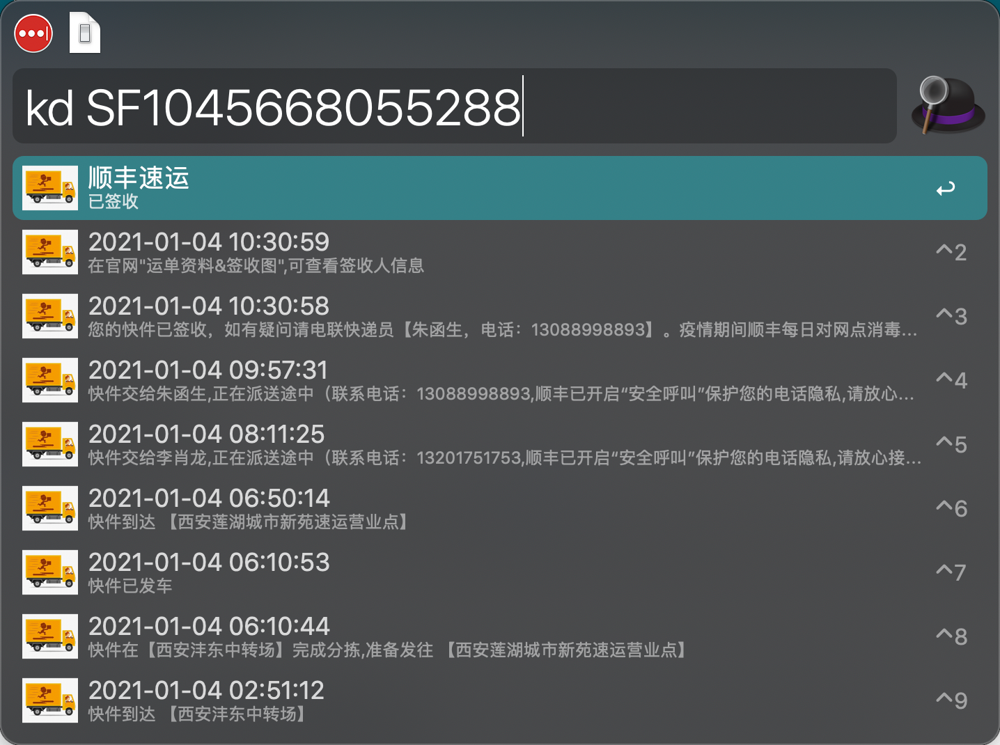
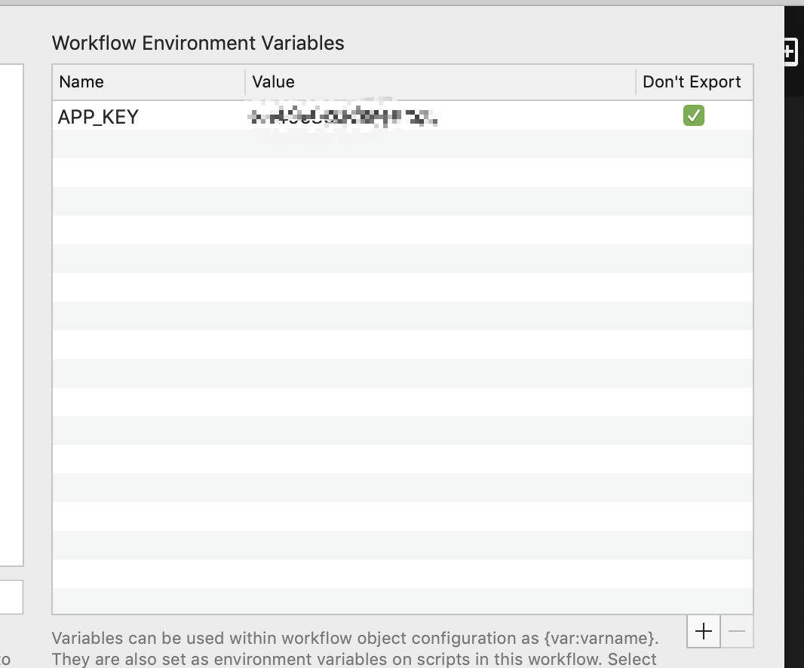

# alfred-express

> [Alfred 4](https://www.alfredapp.com) workflow to get the express package delivery details for npm packages with [npmjs](https://www.npmjs.com/package/alfred-express)



## Install

```
$ npm install --global alfred-express
```

_Requires [Node.js](https://nodejs.org) 8+ and the Alfred [Powerpack](https://www.alfredapp.com/powerpack/)._

## Usage

### 1. get appkey

go to [binstd](https://www.binstd.com/api/express.html), the free account will allow 1000 times api call.

### 2. add appkey in workflow environment variable



### 3. Do it

In Alfred, type `kd`, <kbd>Enter</kbd>, and the package order number, to get the details about the express package.

## Related

- [alfy](https://github.com/sindresorhus/alfy) - Create Alfred workflows with ease

## Known issues

1. Test failed
   The test failed because of can't get the environment variable when running test, I have raise [the issue](https://github.com/SamVerschueren/alfy-test/issues/10) in alfy-test repo.

## License

MIT ©
